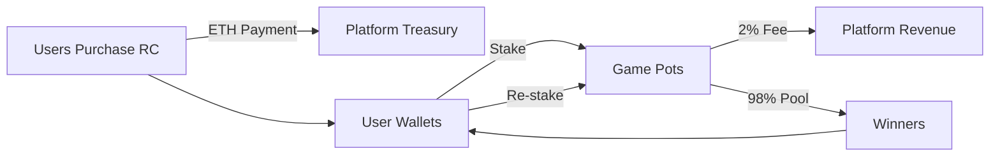

# Tokenomics

## Overview

**Allies of Borderland** operates on a competitive, stake-based economy powered by **RC (Redemption Credits)** tokens. The tokenomics are designed to create a sustainable, player-driven ecosystem where skill and strategy are rewarded while maintaining platform sustainability through transparent fee structures.

---

## Token Specification

| Property | Value |
|----------|-------|
| **Token Name** | Redemption Credits |
| **Symbol** | RC |
| **Blockchain** | Ethereum (Sepolia Testnet → Mainnet) |
| **Token Type** | Utility Token |
| **Decimals** | 0 (whole numbers only) |
| **Supply Model** | Dynamic (mint-on-purchase) |
| **Smart Contract** | GameToken.sol |

---

## Token Utility

RC tokens serve as the primary in-game currency with the following use cases:

### Core Functions
1. **Game Entry**: Required to participate in competitive matches
2. **Staking**: Players stake RC tokens with potential for monetary gains
3. **Room Creation**: Hosts pay a nominal fee to establish multiplayer lobbies
4. **Progression**: Future utility includes cosmetics, NFTs, and premium features

### Token Flow
```
Purchase → Stake → Compete → Win/Lose → Re-stake
```

---

## Token Acquisition

### Purchase Mechanism

RC tokens are acquired by converting **Ethereum (ETH)** through the platform's smart contract interface. All transactions are executed on-chain, ensuring transparency and security.

**Conversion Rate**: `1 RC = 0.0001 ETH`

### Token Packages

The platform offers four standardized token packages optimized for different player engagement levels:

| Package | RC Tokens | ETH Cost | Use Case |
|---------|-----------|----------|----------|
| Starter | 10 | 0.001 | Trial & casual play |
| Popular | 50 | 0.005 | Regular gameplay |
| Standard | 100 | 0.01 | Active players |
| Premium | 500 | 0.05 | High-stakes competition |

> **USD Equivalent** (at ETH = $3,000): 1 RC ≈ $0.30

### New User Bonus

To lower the barrier to entry and encourage platform adoption, new users receive:

**Welcome Bonus**: `200 RC tokens (free)`

**Purpose**: Enables new players to experience the game without financial commitment, reducing acquisition friction and allowing skill assessment before purchase.

**Anti-Abuse Measures**:
- One-time bonus per verified account
- Requires Google OAuth or wallet authentication
- Subject to usage monitoring

---

## Staking Mechanics

### Stake-to-Earn Model

Allies of Borderland employs a **competitive staking system** where players wager RC tokens with the opportunity to earn from the collective pot based on game outcomes.

### Stake Parameters

| Parameter | Value |
|-----------|-------|
| **Minimum Stake** | 1 RC |
| **Maximum Stake** | 100% of balance |
| **Recommended Stake** | 50 RC |

### Game Modes

#### Multiplayer (Competitive)
- **Fixed Buy-In**: Room creator sets entry stake (applies to all players)
- **Room Creation Fee**: 10 RC (paid by host)
- **Pot Composition**: Sum of all player stakes
- **Example**: 5 players × 100 RC = 500 RC pot

#### Single-Player (Practice)
- **Variable Stake**: Player chooses custom amount
- **AI Opponents**: Bots contribute 20-50 RC each (randomized)
- **Pot Composition**: Player stake + AI stakes
- **Example**: Player (100 RC) + 3 AI (120 RC total) = 220 RC pot

---

## Revenue Model

### Platform Fee Structure

The platform sustains operations and development through a **transparent 2% platform fee** applied to every game pot.

**Fee Formula**:
```
Platform Fee (F) = Total Pot (P) × 0.02
Winner Pool (W) = P - F = P × 0.98
```

### Fee Application

| Total Pot | Platform Fee (2%) | Winner Pool (98%) |
|-----------|-------------------|-------------------|
| 100 RC | 2 RC | 98 RC |
| 500 RC | 10 RC | 490 RC |
| 1000 RC | 20 RC | 980 RC |

### Additional Revenue Streams

1. **Token Purchases**: 100% of ETH from token sales
2. **Room Creation**: 10 RC per room (nominal service fee)
3. **Future**: NFT sales, premium memberships, tournament entries

---

## Winner Distribution

### Distribution Algorithm

Upon game conclusion, the remaining pot (after platform fee) is distributed equally among all survivors.

**Distribution Formula**:
```
Per-Winner Reward = (Total Pot × 0.98) ÷ Number of Survivors
```

### Outcome Scenarios

#### Scenario 1: Citizens Eliminate Jack (Single Winner)
```
Game Setup:
- Players: 4
- Stake per player: 100 RC
- Total Pot: 400 RC

Outcome:
- Platform Fee: 400 × 0.02 = 8 RC
- Winner Pool: 400 - 8 = 392 RC
- Survivors: 1 citizen

Winner Receives: 392 RC
Net Profit: 392 - 100 = +292 RC (292% ROI)
```

#### Scenario 2: Multiple Survivors (Jack Eliminated)
```
Game Setup:
- Players: 5
- Stake per player: 50 RC
- Total Pot: 250 RC

Outcome:
- Platform Fee: 250 × 0.02 = 5 RC
- Winner Pool: 250 - 5 = 245 RC
- Survivors: 3 citizens

Each Winner Receives: 245 ÷ 3 = 81.67 RC
Net Profit: 81.67 - 50 = +31.67 RC (63% ROI)
```

#### Scenario 3: Jack Wins (Minimal Survivors)
```
Game Setup:
- Players: 6
- Stake per player: 75 RC
- Total Pot: 450 RC

Outcome:
- Platform Fee: 450 × 0.02 = 9 RC
- Winner Pool: 450 - 9 = 441 RC
- Survivors: 2 (Jack + 1 citizen)

Each Survivor Receives: 441 ÷ 2 = 220.5 RC
Net Profit: 220.5 - 75 = +145.5 RC (194% ROI)

Losers: -75 RC each
```

---

## Economic Model

### Game Theory Analysis

Allies of Borderland is a **negative-sum game** due to the 2% platform fee, meaning the expected value for the average player is:

```
Expected Value (EV) = -2% of stake (assuming equal skill)
```

**Implications**:
- **Skilled players** achieve positive EV through superior strategy
- **Unskilled players** experience negative EV (lose at accelerated rate)
- **Platform** maintains consistent revenue regardless of outcomes

### Win-Rate Requirements

To maintain a break-even balance, players must achieve:

**Minimum Win Rate**: `~51%` (accounting for 2% fee)

**Profitable Play**: Win rate > 51% + margin for long-term gains

### Token Circulation



---

## Supply Management

### Dynamic Supply

RC tokens utilize a **mint-on-purchase model** without a fixed maximum supply. The circulating supply is determined by:

```
Circulating Supply = Total Purchased - Total Burned (if applicable)
```

### Deflationary Mechanisms

**Current Implementation**:
- Room creation fees (10 RC) may be burned or retained
- No token burn on platform fees (kept as revenue)

**Potential Future Mechanisms**:
- Partial fee burn (e.g., 50% of 2% fee)
- Periodic buyback and burn programs
- Achievement-based token removal

---

## Economic Sustainability

### Player Lifecycle

**New Player Journey**:
1. Receives 200 RC welcome bonus
2. Plays 4-10 practice games (average stake: 20 RC)
3. Evaluates skill and enjoyment
4. Purchases 50-100 RC for competitive play

**Active Player Profile**:
- Average balance: 100-500 RC
- Plays 5-15 games per week
- Average stake: 30-75 RC per game
- Net monthly flow: -10% to +20% (skill-dependent)

### Revenue Projections

**Conservative Estimates (Monthly)**:

| Metric | Value |
|--------|-------|
| Active Monthly Users | 1,000 |
| Average Purchase per User | $30 (100 RC) |
| Purchase Revenue | $30,000 |
| Daily Games Played | 500 |
| Average Pot Size | 200 RC |
| Platform Fees Collected | 2,000 RC/day = 60,000 RC/month |
| Fee Revenue (USD) | $18,000 |
| **Total Monthly Revenue** | **$48,000** |

**Scaling Projections**:

| User Base | Monthly Revenue | Annual Revenue |
|-----------|----------------|----------------|
| 1,000 | $48,000 | $576,000 |
| 5,000 | $240,000 | $2,880,000 |
| 10,000 | $480,000 | $5,760,000 |

---

## Risk Mitigation

### Economic Risks

**Risk 1: Whale Accumulation**
- **Issue**: Top players accumulate majority of RC supply
- **Mitigation**: Tiered matchmaking, skill-based lobbies, ranked seasons

**Risk 2: New Player Attrition**
- **Issue**: Unskilled players lose bonuses quickly and leave
- **Mitigation**: Tutorial system, practice mode, gradual unlock of bonuses

**Risk 3: Token Devaluation**
- **Issue**: Excessive supply due to unchecked bonuses
- **Mitigation**: Limit free tokens, implement verification, monitor metrics

**Risk 4: Regulatory Compliance**
- **Issue**: Potential gambling classification
- **Mitigation**: No fiat withdrawal, skill-based gameplay, legal consultation

### Operational Safeguards

1. **Smart Contract Audits**: Third-party security review before mainnet
2. **Rate Limiting**: Prevent automated abuse of bonuses
3. **KYC Integration**: Optional identity verification for high-value players
4. **Transparent Fees**: All fee structures publicly documented
5. **Fair Play Enforcement**: Anti-cheat systems and bot detection

---

## Key Performance Indicators

### Monitoring Metrics

**User Metrics**:
- Daily/Monthly Active Users (DAU/MAU)
- Average session length
- Retention rates (D1, D7, D30)
- New user conversion rate (bonus → purchase)

**Economic Metrics**:
- Total RC in circulation
- Average stake per game
- Platform fees collected (daily/monthly)
- ETH revenue from purchases
- Token velocity (transactions per token per month)

**Health Indicators**:
- Gini coefficient (token distribution inequality)
- Churn rate (players with 0 RC who leave)
- Win-rate distribution (should approximate normal curve)
- Average player lifetime value (LTV)

---

## Future Tokenomics Evolution

### Planned Enhancements

1. **Tiered Membership System**
   - Bronze/Silver/Gold tiers with perks
   - Monthly subscription model (200-500 RC/month)
   - Benefits: Reduced fees, exclusive tournaments, cosmetics

2. **Tournament Ecosystem**
   - Scheduled high-stakes competitions
   - Guaranteed prize pools (funded by platform)
   - Entry fees: 50-500 RC depending on tier

3. **NFT Integration**
   - Unique avatar NFTs purchasable with RC
   - Secondary market trading (platform takes 5% royalty)
   - Rarity tiers with gameplay cosmetics

4. **Referral Program**
   - Reward users for bringing new players
   - Referrer receives 10% of referee's first purchase
   - Builds organic growth loop

5. **Staking 2.0 (Passive Staking)**
   - Lock RC tokens for platform growth participation
   - Earn APY from platform revenue share
   - Minimum lock period: 30/90/180 days

---

## Mathematical Formulas Summary

### Core Calculations

**Token Price**:
```
Price per RC = 0.0001 ETH
USD Value = 0.0001 × Current ETH Price
```

**Platform Fee**:
```
Fee = Total Pot × 0.02
Winner Pool = Total Pot × 0.98
```

**Winner Distribution**:
```
Per-Winner Amount = (Total Pot × 0.98) ÷ Number of Survivors
```

**Player ROI**:
```
ROI = ((Winnings - Stake) ÷ Stake) × 100%
```

**Expected Value (Equal Skill)**:
```
EV per game = Stake × (P(Win) × 0.98 ÷ Avg Survivors - 1)
EV ≈ -0.02 × Stake (for average player)
```

**Platform Revenue per Game**:
```
Revenue = Σ(All Player Stakes) × 0.02
```

---

## Conclusion

The Allies of Borderland tokenomics establish a **competitive, skill-based economy** that aligns player incentives with platform growth. The 2% platform fee ensures sustainable revenue while maintaining a 98% player-to-player redistribution, creating a dynamic marketplace where strategic gameplay is rewarded.

**Key Principles**:
- ✅ Transparent fee structures
- ✅ Skill-based rewards (not pure gambling)
- ✅ Sustainable platform economics
- ✅ Low barrier to entry (200 RC bonus)
- ✅ Scalable revenue model

The combination of ETH-based token purchases and gameplay fees positions the platform for long-term viability while providing players with an engaging, competitive experience where every decision carries meaningful economic weight.

---

**Document Version**: 1.0  
**Last Updated**: December 2025  
**Smart Contract**: [GameToken.sol](contracts/GameToken.sol)  
**Network**: Ethereum Sepolia (Testnet)
